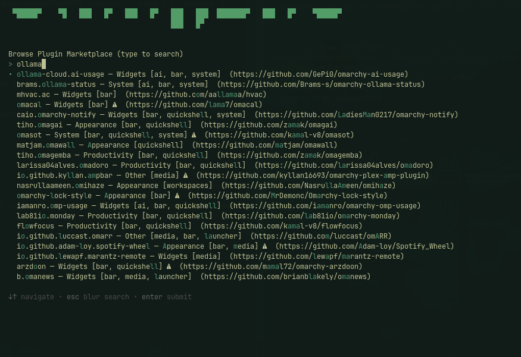

# Widget Controller

An [Omarchy](https://omarchy.org/) taskbar plugin: one icon that opens a menu
for managing bar widgets — list what's installed, move a widget between
sections, remove one, or uninstall a third-party one entirely — plus a
"Browse Plugin Marketplace" flow that pulls the community registry behind
[plugins.omarchy.org](https://plugins.omarchy.org) and installs by picking
one.

It's a thin front-end over Omarchy's own CLI (`omarchy bar`, `omarchy
plugin`) via the same `omarchy-menu-select` picker Omarchy's built-in
`omarchy menu plugin` command uses — no bespoke logic for managing plugins,
just a friendlier menu over the real commands.

## Install

```bash
omarchy plugin add https://github.com/jchisholm59/omarchy-widget-controller.git --enable
```

That's it — the bundled script (`bin/omarchy-widget-controller`) needs
nothing installed separately or added to `PATH`.

<p></p>

## Remove

```bash
omarchy plugin remove jim.widget-controller
rm -rf ~/.cache/omarchy-widget-controller   # optional: the cached marketplace listing
```

## Use

Click the puzzle-piece icon in the bar:

- **Installed Widgets** — pick one to move it (left/center/right), remove it
  from the bar (disables — re-enable any time from the same menu), or, for a
  non-built-in widget, uninstall it completely.
- **Browse Plugin Marketplace** — searches the [omarchy-plugin-marketplace
  registry](https://github.com/omacom/omarchy-plugin-marketplace); picking
  one runs `omarchy plugin add <repo> --enable`, which shows Omarchy's own
  "this runs unsandboxed code" warning and asks to confirm before cloning.
  Entries flagged ⚠ failed the registry's automated security scan
  ("review-required") — not necessarily bad, just worth a look first.
- **Refresh Marketplace Listing** — the registry (~7MB) is cached for 24h;
  use this to force an update sooner.

## Requirements

Just Omarchy itself: `jq`, `curl` and `gum` (all part of a stock Omarchy install) are the only dependencies.
No sudo. The only network access is a download of the public marketplace `registry.json` from GitHub
(cached in `~/.cache/omarchy-widget-controller/` for 24h); installs go through Omarchy's own
`omarchy plugin add`, which shows its warning and asks for confirmation.
